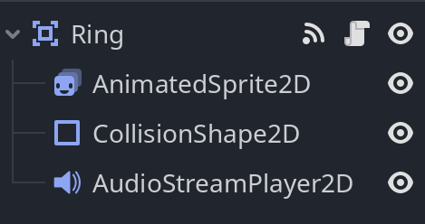

# Tutorial 5 Game Development
Assets Creation & Integration

Nama : Favian Naufal  
NPM  : 2006597802

## Penjelasan Pembuatan dan Penambahan Variasi Asset

Objek baru yang dibuat adalah sebuah *Ring* atau cincin emas yang dapat di koleksi oleh karakter yang dikendalikan pemain, dengan *scene* yang digunakan seperti berikut ini:



*Root node* yang digunakan adalah sebuah `Area2D`. Tipe node tersebut digunakan agar dapat diberikan sebuah child node `CollisionShape2D`, sehingga area collision dapat digunakan untuk mendeteksi *signal* `_on_body_entered()` ketika karakter pemain menyentuh objek *Ring* tersebut, dengan kode berikut ini:

```
extends Area2D

var velocity = Vector2(0, -100)
var is_collected = false

@onready var anim_sprite = $AnimatedSprite2D
@onready var audio_player = $AudioStreamPlayer2D

func _ready():
	anim_sprite.play("default")

func _on_body_entered(body: Node2D) -> void:
	if not is_collected:
		audio_player.play()
	is_collected = true


func _process(delta):
	if is_collected:
		velocity.y += gravity * delta
		global_position += velocity * delta

		if velocity.y > 0 and global_position.y >= position.y:
			await audio_player.finished
			queue_free()
```
Berdasarkan kode di atas, objek *Ring* akan memiliki *motion* terjun ke bawah seakan-akan terjun keluar *stage*, dengan makna onjek *Ring* tersebut terkoleksi oleh pemain.

Di sisi lain, kode tersebut juga memberikan SFX ketika objek *Ring* terkoleksi dengan menggunakan *child node* `AudioStreamPlayer2D`, serta menghapus objek dari scene ketika seluruh proses '*coin collection*' terjalankan.

Sebuah *child node* `AnimatedSprite2D` juga digunakan untuk memberikan efek *looped animation* dengan menggunakan *Sprite sheet* *Ring* yang didapatkan.

*Background music* yang digunakan juga diakses melalui node `AudioStreamPlayer2D` sebagai *child node* dari *main* scene, dengan BGM yang digunakan didapatkan dari *No-Copyright Music* .


## Resource yang digunakan

- **Background music track yang digunakan**: Naturally by Pufino  
Source: https://freetouse.com/music  
No Copyright Music (Free Download)  

- **Rings**: https://www.spriters-resource.com/sega_genesis_32x/sonicth3/sheet/9985/

- **Ring Collection SFX**: https://www.youtube.com/watch?v=n9GImjHkLmE